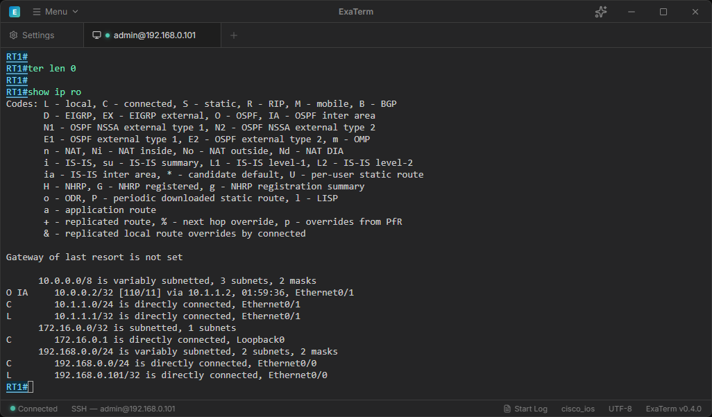

<p align="center">
  
</p>

<h1 align="center">ExaTerm</h1>

<p align="center">
  <a href="https://github.com/caribouHY/exaterm/releases"></a>
  <a href="#supported-os"></a>
  <a href="https://app.codacy.com/gh/caribouHY/exaterm/dashboard?utm_source=gh&utm_medium=referral&utm_content=&utm_campaign=Badge_grade"></a>
  <a href="https://github.com/caribouHY/exaterm/releases"></a>
  <a href="LICENSE"></a>
</p>

ExaTerm is a terminal app for SSH, Telnet, and serial communication with AI agent integration and built-in AI chat.

[日本語版 README](README.ja.md)



## Features

- SSH, Telnet, and serial communication
- A CLI tool and Agent Skill for AI agents
- Built-in terminal AI chat
- Session logging with manual and automatic modes
- Network-device color highlighting with Cisco IOS, Arista EOS, Juniper Junos, VyOS, Fujitsu Si-R, Allied Telesis AW+, and Furukawa FITELnet support

## Supported OS

ExaTerm currently supports Windows only.

macOS and Linux are not supported release targets at this time.

## Installation

Install ExaTerm with winget:

```powershell
winget install caribouhy.ExaTerm
```

Alternatively, download an installer from this repository's [Releases page](https://github.com/caribouHY/exaterm/releases).

## Command-Line Startup

Pass arguments to `exaterm.exe` to start ExaTerm and open an SSH or Telnet connection. The target can be a hostname, an IP address, or a saved profile name.

```powershell
exaterm.exe ssh <user@hostname-or-ip-address|profile-name>
exaterm.exe telnet <hostname-or-ip-address|profile-name>
exaterm.exe help
```

## AI Agent Integration

The bundled `exaterm-cli` tool and dedicated Agent Skill let AI agents such as Claude and Codex control ExaTerm. To use `exaterm-cli`, enable **Enable External Control** and **Enable Terminal CLI** in Settings. See the [Terminal CLI guide](docs/CLI_GUIDE.en.md) for usage.

To start a new SSH or Telnet connection through external control, enable **Allow External New Connections** and create a saved connection profile that allows external control.

### Agent Skill

Install the `exaterm-cli` Skill from this repository for use with supported AI agents:

```powershell
npx skills add caribouHY/exaterm --skill exaterm-cli
```

Use the `-a` option to target a specific agent:

```powershell
npx skills add caribouHY/exaterm --skill exaterm-cli -a codex
npx skills add caribouHY/exaterm --skill exaterm-cli -a claude-code
npx skills add caribouHY/exaterm --skill exaterm-cli -a github-copilot
```

The Skill does not include ExaTerm itself. Install ExaTerm separately, then enable **Enable External Control** and **Enable Terminal CLI** in Settings.

### MCP Integration

ExaTerm supports a stdio MCP compatibility adapter through `exaterm-mcp.exe`. To use it, enable **Enable External Control** and **Enable MCP Compatibility Adapter** in Settings.

To start a new SSH or Telnet connection through external control, enable **Allow External New Connections** and create a saved connection profile that allows external control.

External control can read terminal output and send input or commands. Terminal content may contain sensitive information, so enable it only for trusted local clients.

## AI Assistant

The AI assistant can use terminal context from the active tab to help explain output and suggest commands. Review any suggested command before running it in a terminal session.

OpenAI, Azure OpenAI, Anthropic, Gemini, and OpenRouter require provider API keys or endpoint settings. Save or clear provider credentials from Settings.

Ollama usually does not require an API key, but it does require a running Ollama server that ExaTerm can reach.

## Data Storage Locations

Configuration files, logs, and related data are stored in the following locations:

| Data                  | Location                          |
| --------------------- | --------------------------------- |
| Settings              | `%AppData%\ExaTerm\config.json`   |
| Optional session logs | `%AppData%\ExaTerm\logs`          |
| SSH known hosts       | `%AppData%\ExaTerm\known_hosts`   |
| AI service API keys   | Operating system credential store |

- [Config guide](docs/CONFIG_JSON_GUIDE.en.md)
- [Terminal CLI guide](docs/CLI_GUIDE.en.md)
- [Documentation index](docs/README.en.md)

## Developer Setup

Developer setup requires Rust and Node.js.

1. Clone the repository.
2. Install pnpm:

```powershell
npm install -g pnpm@10.33.2
```

3. Install dependencies:

```powershell
pnpm install
```

4. Start the Tauri development app:

```powershell
pnpm run tauri dev
```

5. Build the frontend:

```powershell
pnpm run build
```

6. Build the Windows exe package:

```powershell
pnpm run tauri build
```

## License

ExaTerm is released under the MIT License. See [LICENSE](LICENSE).
